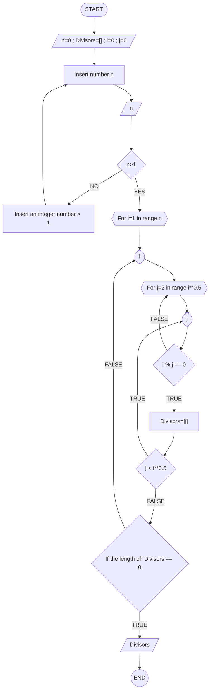
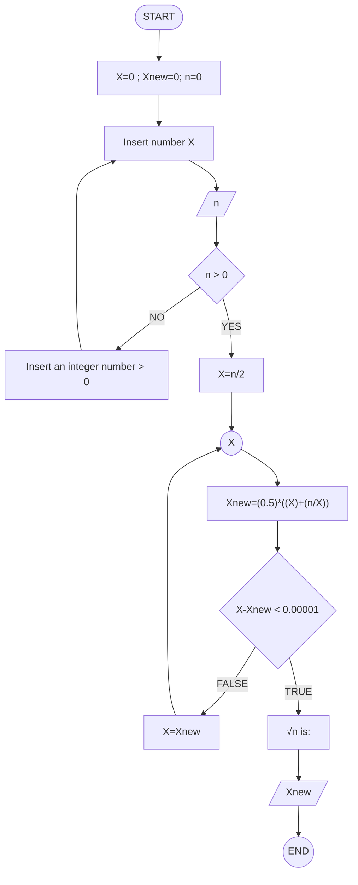

# Reto número 4 repo
### Fecha:  30-08-2023
**1.** Algoritmo para obtener los números primos hasta un número n
* Primero realicé el diagrama de flujo para facilitar el proceso de creación del pseudocódigo:

* Despues, teniendo en cuenta el diagrama de flujo escribí el pseudocodigo de la siguiente manera:
```pseudocode
Algoritmo Numerosprimos
	n=0
	Divisors=[]
	i=0
	j=0
	Escribir Insert number n
	Leer n
	Si n>1 Entonces
		Para i<-1 Hasta n Hacer
			Para j<-2 Hasta i^0.5 Hacer
				Si i%j==0 Entonces
					Divisors=[j]
					Si j<i^0.5 Entonces
						#Ir a j
					SiNo
						Si length of Divisors==0 Entonces
							Leer Divisors
						SiNo
							#Ir a i
						Fin Si
					Fin Si
				SiNo
					#Devolver a j
				Fin Si
			Fin Para
		Fin Para
	SiNo
		Escribir Insert an integer number > 1
		#Ir a inicio
	Fin Si
FinAlgoritmo
FinAlgoritmo
```
* Intento de código:
```code
#Variables:
n : int = 0
i : int
j : int
Divisors = []
#Inicio
print("Insert number n")
n=int( input("n: "))
if (n > 1):
| for i=1 in range n:
| | for j=2 in range i^0.5:
| | |  if i%j=0: 
| | |  | Divisors.append(j)
| | |    if j < i**0.5:
| | |    | #¿cómo poner se devuelve a for j?
| | |    else:
| | |     if the length of Divisors=0: #¿cómo poner la logitud?
| | |     | print(Divisors)
| | |     else:
| | |       #¿cómo devolverlo al for del i?
else:
  print("Insert an integer number > 1")  #¿cómo devolverlo paso de insertar?
#Fin
```
**2.** Algoritmo para obtener la raiz cuadrada de un número n
* Primero realicé el diagrama de flujo para facilitar el proceso de creación del pseudocódigo, me basé en el método de Newton Raphson:

Referencia: http://ojs.urepublicana.edu.co/index.php/ingenieria/article/view/347/314

* Despues, teniendo en cuenta el diagrama de flujo escribí el pseudocodigo de la siguiente manera:
```pseudocode
Algoritmo RaizCuadrada
	X=0
	Xnew=0
	n=0
	Escribir Insert number X
	Leer X
	Si n>0 Entonces
		X=n/2
		Leer X
		Xnew=(0.5)*((X)+(n/X))
		Si X-Xnew<0.00001 Entonces
			Escribir "n^0.5 is:"
			Leer Xnew
		SiNo
			X=Xnew
			#Devolverse linea 9
		Fin Si
	SiNo
		Escribir Insert an integer number > 0
		#ir a donde se ingresa el X
	Fin Si
FinAlgoritmo
```
* Intento de código:
```code
#Variables:
n : int = 0
X : int
Y : int
#Inicio
print("Insert number n")
n=int( input("n: "))
if (n > 0): #¿Debo escribirlo cómo entonces o puedo dejarlo asi?
| X=n/2
| Y=(0.5)*((X)+(n/X))
| if X-Y<0.00001:
| | print(√n is:)
| | print(Y)
| else:
|  X=Y
|  #¿cómo devolver a X?
else:
  print("Insert an integer number > 0")  #¿cómo devolverlo paso de insertar?
#Fin
```
